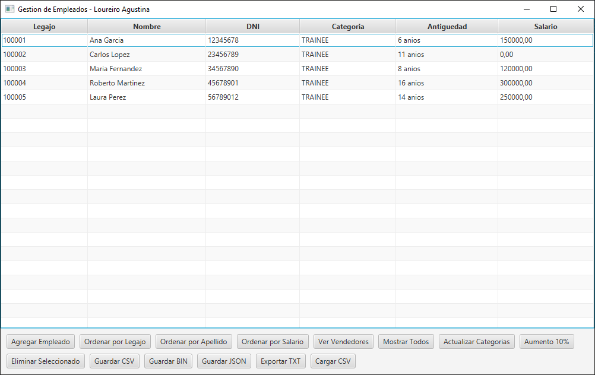
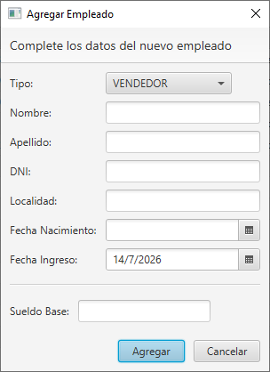
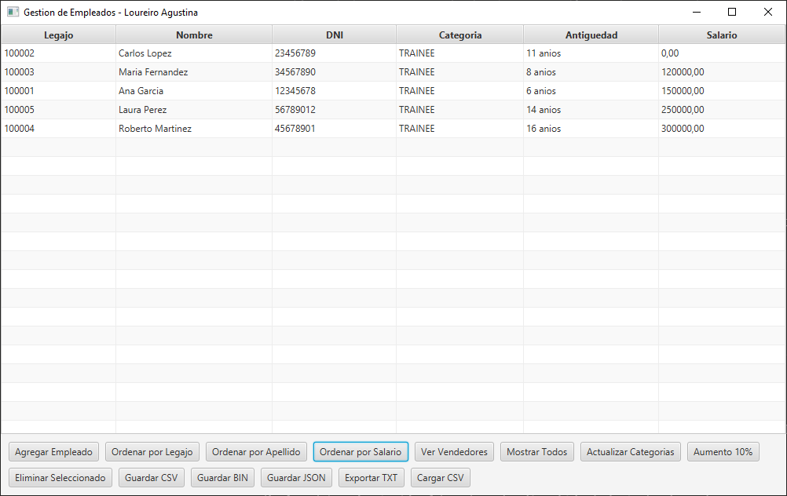
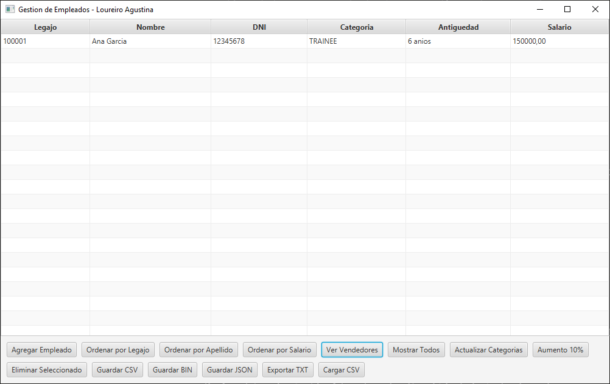
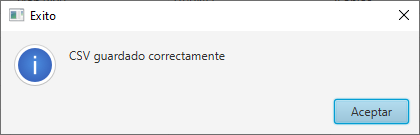
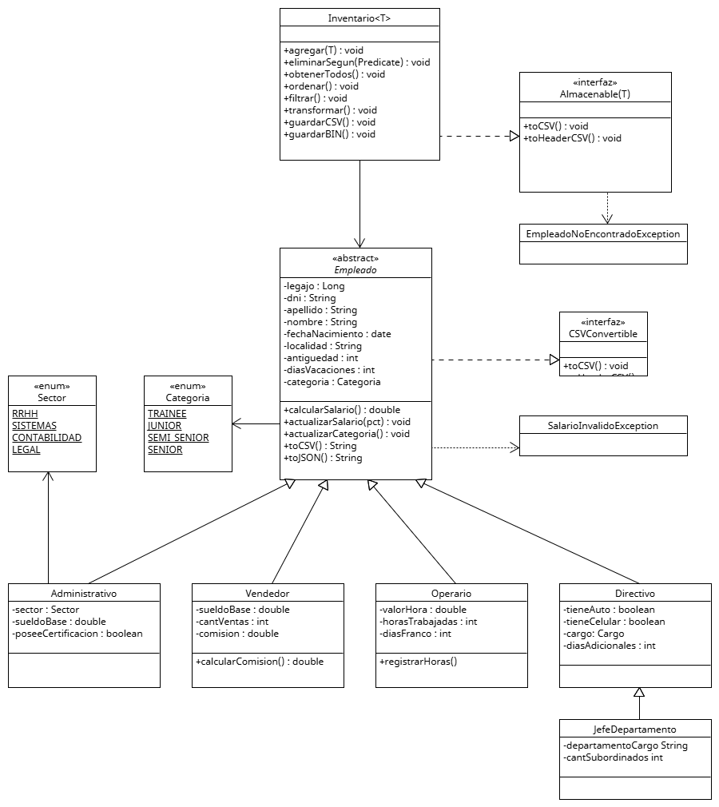

# Gestión de Empleados

## Sobre mí
Soy Agustina Loureiro, estudiante de la Tecnicatura Universitaria en Programación 
de UTN Avellaneda (Legajo N° 118.336). Cursé Programación II en el segundo
cuatrimestre 2025, en la comisión 322, con los docentes Christian Baus y Felipe Bustos.

## Resumen
Sistema de gestión de empleados desarrollado en Java, que permite administrar 
distintos tipos de empleados (Vendedores, Operarios, Administrativos, Directivos 
y Jefes de Departamento) mediante operaciones CRUD completas.

El sistema modela una jerarquía de herencia de dos niveles a partir de una clase 
abstracta `Empleado`, e incluye:
- Ordenamiento por criterio natural (legajo) y por criterios alternativos (apellido, salario)
- Filtrado de empleados mediante `Predicate`
- Modificaciones masivas mediante interfaces funcionales (`Function`, `Predicate`)
- Persistencia en formato binario, CSV y JSON
- Exportación de reportes filtrados a archivos de texto
- Iterator personalizado para recorrer el inventario
- Interfaz gráfica desarrollada con JavaFX

### Cómo se usa
Al iniciar la aplicación, se muestra una tabla con empleados de ejemplo precargados. 
Desde los botones de la interfaz se puede:
- Agregar un nuevo empleado (formulario dinámico según el tipo elegido)
- Ordenar por legajo, apellido o salario
- Filtrar por tipo de empleado
- Actualizar categorías y aplicar aumentos de salario
- Eliminar el empleado seleccionado
- Guardar y cargar los datos en distintos formatos (CSV, binario, JSON)
- Exportar un reporte en texto plano

## Diagrama de clases UML

## Archivos generados
El sistema genera los siguientes archivos como ejemplo de cada funcionalidad de 
persistencia, ubicados en `src/data/`:
- `empleados.bin` — serialización binaria
- `empleados.csv` — formato CSV
- `empleados.json` — formato JSON
- `reporte.txt` — reporte filtrado en texto plano
